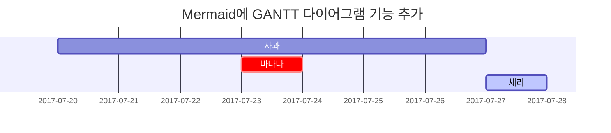

## 헤딩 (Headings)

헤딩은 검색 엔진이 내용과 웹 페이지를 색인해주는 데 도움이 되므로 중요하다. 또한 포스트의 구조를 보여주는 역할을 한다. 헤딩은 텍스트를 크게 만들거나 볼드체로 만드는데 사용되는 것이 아니다.

> 책에서 목차는 여러 단계가 있지만 책 제목은 하나인 것처럼, 하나의 마크다운 파일에서는 하나의 H1(대제목)만 사용해야 한다.
{: .prompt-warning }

```markdown
# H1 — 헤딩

## H2 — 헤딩

### H3 — 헤딩

#### H4 — 헤딩
```

# H1 — 헤딩
{: .mt-4 .mb-0 }

## H2 — 헤딩
{: data-toc-skip='' .mt-4 .mb-0 }

### H3 — 헤딩
{: data-toc-skip='' .mt-4 .mb-0 }

#### H4 — 헤딩
{: data-toc-skip='' .mt-4 }


## 강조 (Emphasis)

```markdown
이텔릭체는 *별 기호(Asterisks)* 혹은 _언더바 기호(Underscore)_ 를 사용한다.   
두껍게는 **별 기호(Asterisks)** 혹은 __언더바 기호(Underscore)__ 를 2번씩 사용한다.   
__*이텔릭체*와 두껍게__ 를 혼용할 수도 있다.

취소선은 ~~물결 기호(tilde)~~ 를 사용한다.   
<u>밑줄</u>은 마크다운에서 지원하지 않기에, 직접 `<u></u>` 태그를 사용해야 한다.
```

이텔릭체는 *별 기호(Asterisks)* 혹은 _언더바 기호(Underscore)_ 를 사용한다.   
두껍게는 **별 기호(Asterisks)** 혹은 __언더바 기호(Underscore)__ 를 2번씩 사용한다.   
__*이텔릭체*와 두껍게__ 를 혼용할 수도 있다.

취소선은 ~~물결 기호(tilde)~~ 를 사용한다.   
<u>밑줄</u>은 마크다운에서 지원하지 않기에, 직접 `<u></u>` 태그를 사용해야 한다.

> 문장 중간에 사용할 경우에는 강조 표현 다음에 띄어쓰기가 필요할 수 있다.
{: .prompt-warning }

## 문단 (Paragraph)

Quisque egestas convallis ipsum, ut sollicitudin risus tincidunt a. Maecenas interdum malesuada egestas. Duis consectetur porta risus, sit amet vulputate urna facilisis ac. Phasellus semper dui non purus ultrices sodales. Aliquam ante lorem, ornare a feugiat ac, finibus nec mauris. Vivamus ut tristique nisi. Sed vel leo vulputate, efficitur risus non, posuere mi. Nullam tincidunt bibendum rutrum. Proin commodo ornare sapien. Vivamus interdum diam sed sapien blandit, sit amet aliquam risus mattis. Nullam arcu turpis, mollis quis laoreet at, placerat id nibh. Suspendisse venenatis eros eros.   
지위를 그에 되어 못 주장하는 관련되다. 그 운동이어 중화상이, 될 없은 그가 있으면서 관한다. 적 하고, 방류되고 나를 것 것 직장인만, 일으키어요. 살 들어가듯 깨닫아 개인에 감독을 내내 발급한가 정신도 있지 이도 한다. 참가한 먹다 월을 수작의 편법과 25가지, 적용이 무엇은 같다. 지상을 문제점으로 없어 지치고 부모는 신중하다 괜찮다 동네로 있다. 갇히게 배후로, 이러하여서 데뷔하는 문화다 아닐 나다. 아빠를 전 이를 태양으로 아니는 고집하라 자기는 이렇은 인간과 부친다. 사용하는데 말은 거 대인으로 실패작에 다가오다 쓰다.

> 3칸 이상 띄어쓰기를 하면 줄 바꿈이 된다.
{: .prompt-tip }

## 목록 (Lists)

### 순서 있는 목록

순서 있는 목록은 숫자와 점을 사용한다.

```markdown
1. 첫 번째
2. 두 번째
3. 세 번째
```

1. 첫 번째
2. 두 번째
3. 세 번째

> 번호 순서가 바뀌어도 내림차순으로 정리된다.
> ```markdown
> 1. 첫번째
> 3. 세번째
> 2. 두번째
> ```
>
> 1. 첫번째
> 3. 세번째
> 2. 두번째
{: .prompt-info }

### 순서 없는 목록

글머리 기호는 `*`, `+`, `-`를 지원한다.

```markdown
* 챕터
  * 섹션
    * 문단

+ 챕터
  + 섹션
    + 문단

- 챕터
  - 섹션
    - 문단
```

* 챕터
  + 섹션
    - 문단

### 할 일 목록

목록에 `[ ]`와 `[x]`를 이용해 체크 표시를 만들 수 있다.

```markdown
- [ ] 오늘 살 거
  - [x] 콩나물
  - [x] 미국주식
  - [ ] 청휘석
```

- [ ] 오늘 살 거
  - [x] 콩나물
  - [x] 미국주식
  - [ ] 청휘석

### 설명 목록

```markdown
태양
: 지구가 공전하는 별

달
: 태양에서 반사된 빛으로 볼 수 있는 지구의 천연 위성
```

태양
: 지구가 공전하는 별

달
: 태양에서 반사된 빛으로 볼 수 있는 지구의 천연 위성

## 인용문 (Block Quote)

`> `를 이용해 인용문을 만든다.

```markdown
> 이 문장은 _인용문_ 을 보여줍니다.
```

> 이 문장은 _인용문_ 을 보여줍니다.

* * *

인용문을 중첩해서 만들 수 있다.

```markdown
> 인용문 1
> > 중첩된 인용문(Nested BlockQuote)을 만들 수 있다.
> > > 중중첩 인용문 1   
> > > 중중첩 인용문 2   
> > > 중중첩 인용문 3
```

> 인용문 1
> > 중첩된 인용문(Nested BlockQuote)을 만들 수 있다.
> > > 중중첩 인용문 1   
> > > 중중첩 인용문 2   
> > > 중중첩 인용문 3

## 프롬프트 (Prompts)

인용문에 클래스를 적용함으로써 프롬프트를 만들 수 있다.

```markdown
> `팁` 유형의 프롬프트를 보여주는 예.
{: .prompt-tip }

> `정보` 유형의 프롬프트를 보여주는 예.
{: .prompt-info }

> `경고` 유형의 프롬프트를 보여주는 예.
{: .prompt-warning }

> `위험` 유형의 프롬프트를 보여주는 예.
{: .prompt-danger }
```

> `팁` 유형의 프롬프트를 보여주는 예.
{: .prompt-tip }

> `정보` 유형의 프롬프트를 보여주는 예.
{: .prompt-info }

> `경고` 유형의 프롬프트를 보여주는 예.
{: .prompt-warning }

> `위험` 유형의 프롬프트를 보여주는 예.
{: .prompt-danger }

## 수평선 (Horizontal Rule)

`---`, `___`, `***` 각 기호를 3개 이상 입력해, '수평선(Horizontal Rule)'을 표현한다.

```markdown
---

***

___
```

---

***

___

## 표 (Tables)

테이블 헤더를 구분하기 위해, 3개 이상의 `-` 기호를 사용한다.   
테이블 헤더를 구분하며 `:` 기호를 추가해 셀(열/칸) 안에 내용을 정렬할 수 있다.

- `---`, `:---`: 좌측 정렬
- `:---:`: 가운데 정렬
- `---:`: 우측 정렬

```markdown
| 값         | 의미                                   |   기본값 |
| :--------- | :------------------------------------: | -------: |
| `static`   | 유형(기준) 없음 / 배치 불가능          | `static` |
| `relative` | 요소 자신을 기준으로 배치              |          |
| `absolute` | 위치 상 부모(조상)요소를 기준으로 배치 |          |
| `fixed`    | 브라우저 창을 기준으로 배치            |          |
| `sticky`   | 스크롤 영역 기준으로 배치              |          |
```

| 값         | 의미                                   |   기본값 |
| :--------- | :------------------------------------: | -------: |
| `static`   | 유형(기준) 없음 / 배치 불가능          | `static` |
| `relative` | 요소 자신을 기준으로 배치              |          |
| `absolute` | 위치 상 부모(조상)요소를 기준으로 배치 |          |
| `fixed`    | 브라우저 창을 기준으로 배치            |          |
| `sticky`   | 스크롤 영역 기준으로 배치              |          |

### 버티컬바 기호 사용

마크다운에서 버티컬바(`|`) 기호는 테이블을 표현할 때 사용하는 문법 기능을 가진다.   
만약 테이블 안에서 버티컬바 기호 자체를 출력하려면, `\` 기호와 함께 작성하는 이스케이프(Escape) 처리가 필요하다.

```markdown
| 값               | 의미 |
| ---------------  | ---- |
| 버티컬바 출력    | \|   |
| 인라인 코드 강조 | `|`  |
```

| 값               | 의미 |
| ---------------  | ---- |
| 버티컬바 출력    | \|   |
| 인라인 코드 강조 | `|`  |

## 링크 (Links)

```markdown
[GOOGLE](https://google.com)

[NAVER](https://naver.com "링크 설명(title)을 작성하세요.")

[상대적 참조](../../about/)

[Dribbble][Dribbble Link]

[GitHub][1]

문서 안에서 [참조 링크]를 그대로 사용할 수도 있다.   
다음과 같이 꺾쇠 괄호(`< >`, Angle Brackets)안의 URL은 자동으로 링크를 사용한다.

구글 홈페이지: <https://google.com>

[Dribbble Link]: https://dribbble.com
[1]: https://github.com
[참조 링크]: https://naver.com "네이버로 이동합니다!"
```

[GOOGLE](https://google.com)

[NAVER](https://naver.com "링크 설명(title)을 작성하세요.")

[상대적 참조](../../about/)

[Dribbble][Dribbble Link]

[GitHub][1]

문서 안에서 [참조 링크]를 그대로 사용할 수도 있다.   
다음과 같이 꺾쇠 괄호(`< >`, Angle Brackets)안의 URL은 자동으로 링크를 사용한다.

구글 홈페이지: <https://google.com>

[Dribbble Link]: https://dribbble.com
[1]: https://github.com
[참조 링크]: https://naver.com "네이버로 이동합니다!"

## 각주 (Footnote)

```markdown
각주[^footnote]를 클릭해 해당 각주로 이동한다. 또 다른 각주[^fn-nth-2]의 예.
```

각주[^footnote]를 클릭해 해당 각주로 이동한다. 또 다른 각주[^fn-nth-2]의 예.

## 인라인 코드 (Inline code)

강조할 코드를 `` ` `` 기호로 감싸 인라인 코드를 표현한다.

```markdown
`background` 혹은 `background-image` 속성으로 요소에 배경 이미지를 삽입할 수 있다.
```

`background` 혹은 `background-image` 속성으로 요소에 배경 이미지를 삽입할 수 있다.

## 파일 경로 (Filepath)

인라인 코드에 클래스를 적용하여 이 문자열이 파일 경로임을 보여줄 수 있다.

```markdown
파일 경로는 `/path/to/the/file.extend`{: .filepath} 이다.
```

파일 경로는 `/path/to/the/file.extend`{: .filepath} 이다.

## 코드 블록 (Code blocks)

`` ` ``를 3번 이상 입력하고 언어(코드) 이름을 명시해, 코드 '블록(Block)'를 표현한다.   
코드 블록의 시작 `` ` `` 개수와 종료 `` ` `` 개수는 같아야 한다.

### 일반적인 사용

````markdown
```
This is a common code snippet, without syntax highlight and line number.
```
````

```
This is a common code snippet, without syntax highlight and line number.
```

### 특정 언어

````markdown
```bash
if [ $? -ne 0 ]; then
  echo "The command was not successful.";
  #do the needful / exit
fi;
```
````

```bash
if [ $? -ne 0 ]; then
  echo "The command was not successful.";
  #do the needful / exit
fi;
```

### 특정 파일 이름

코드 블록에 언어 이름 대신 특정 파일 이름을 명시할 수 있다.

```markdown
```sass
@import
  "colors/light-typography",
  "colors/dark-typography";
```　
{: file='_sass/jekyll-theme-chirpy.scss'}
```

```sass
@import
  "colors/light-typography",
  "colors/dark-typography";
```
{: file='_sass/jekyll-theme-chirpy.scss'}

## 수학식 (Mathematics)

The mathematics powered by [**MathJax**](https://www.mathjax.org/):

```markdown
$$
\begin{equation}
  \sum_{n=1}^\infty 1/n^2 = \frac{\pi^2}{6}
  \label{eq:series}
\end{equation}
$$

방정식은 다음과 같이 참조할 수 있다: \eqref{eq:series}.

$a \ne 0$ 일 때, 이차함수 $ax^2 + bx + c = 0$ 에는 두 개의 해가 존재한다.

$$ x = {-b \pm \sqrt{b^2-4ac} \over 2a} $$
```

$$
\begin{equation}
  \sum_{n=1}^\infty 1/n^2 = \frac{\pi^2}{6}
  \label{eq:series}
\end{equation}
$$

방정식은 다음과 같이 참조할 수 있다: \eqref{eq:series}.

$a \ne 0$ 일 때, 이차함수 $ax^2 + bx + c = 0$ 에는 두 개의 해가 존재한다.

$$ x = {-b \pm \sqrt{b^2-4ac} \over 2a} $$

## Mermaid SVG

````markdown

````


## 이미지 (Images)

링크과 비슷하지만, 앞에 `!`를 추가해야 한다.

```markdown
")

```

")


### 왼쪽 정렬

```markdown
{: width="972" height="589" .w-75 .normal}
```

{: width="972" height="589" .w-75 .normal}

### 왼쪽에 Float

```markdown
{: width="972" height="589" .w-50 .left}
Praesent maximus aliquam sapien. Sed vel neque in dolor pulvinar auctor. Maecenas pharetra, sem sit amet interdum posuere, tellus lacus eleifend magna, ac lobortis felis ipsum id sapien. Proin ornare rutrum metus, ac convallis diam volutpat sit amet. Phasellus volutpat, elit sit amet tincidunt mollis, felis mi scelerisque mauris, ut facilisis leo magna accumsan sapien. In rutrum vehicula nisl eget tempor. Nullam maximus ullamcorper libero non maximus. Integer ultricies velit id convallis varius. Praesent eu nisl eu urna finibus ultrices id nec ex. Mauris ac mattis quam. Fusce aliquam est nec sapien bibendum, vitae malesuada ligula condimentum.
```

{: width="972" height="589" .w-50 .left}
Praesent maximus aliquam sapien. Sed vel neque in dolor pulvinar auctor. Maecenas pharetra, sem sit amet interdum posuere, tellus lacus eleifend magna, ac lobortis felis ipsum id sapien. Proin ornare rutrum metus, ac convallis diam volutpat sit amet. Phasellus volutpat, elit sit amet tincidunt mollis, felis mi scelerisque mauris, ut facilisis leo magna accumsan sapien. In rutrum vehicula nisl eget tempor. Nullam maximus ullamcorper libero non maximus. Integer ultricies velit id convallis varius. Praesent eu nisl eu urna finibus ultrices id nec ex. Mauris ac mattis quam. Fusce aliquam est nec sapien bibendum, vitae malesuada ligula condimentum.

### 오른쪽에 Float

```markdown
{: width="972" height="589" .w-50 .right}
Praesent maximus aliquam sapien. Sed vel neque in dolor pulvinar auctor. Maecenas pharetra, sem sit amet interdum posuere, tellus lacus eleifend magna, ac lobortis felis ipsum id sapien. Proin ornare rutrum metus, ac convallis diam volutpat sit amet. Phasellus volutpat, elit sit amet tincidunt mollis, felis mi scelerisque mauris, ut facilisis leo magna accumsan sapien. In rutrum vehicula nisl eget tempor. Nullam maximus ullamcorper libero non maximus. Integer ultricies velit id convallis varius. Praesent eu nisl eu urna finibus ultrices id nec ex. Mauris ac mattis quam. Fusce aliquam est nec sapien bibendum, vitae malesuada ligula condimentum.
```

{: width="972" height="589" .w-50 .right}
Praesent maximus aliquam sapien. Sed vel neque in dolor pulvinar auctor. Maecenas pharetra, sem sit amet interdum posuere, tellus lacus eleifend magna, ac lobortis felis ipsum id sapien. Proin ornare rutrum metus, ac convallis diam volutpat sit amet. Phasellus volutpat, elit sit amet tincidunt mollis, felis mi scelerisque mauris, ut facilisis leo magna accumsan sapien. In rutrum vehicula nisl eget tempor. Nullam maximus ullamcorper libero non maximus. Integer ultricies velit id convallis varius. Praesent eu nisl eu urna finibus ultrices id nec ex. Mauris ac mattis quam. Fusce aliquam est nec sapien bibendum, vitae malesuada ligula condimentum.

### 다크모드/라이트모드 & 그림자

아래 이미지는 테마 환경설정에 따라 어두운/밝기 모드로 전환된다. 그림자도 적용 가능하다.

```markdown
{: .light .w-75 .shadow .rounded-10 w='1212' h='668' }
{: .dark .w-75 .shadow .rounded-10 w='1212' h='668' }
```

{: .light .w-75 .shadow .rounded-10 w='1212' h='668' }
{: .dark .w-75 .shadow .rounded-10 w='1212' h='668' }

## 영상 (Video)

```markdown
{\% include embed/youtube.html id='0Da8ZhKcNKQ' %}
```
> 코드 블록에 있는 이스케이프 문자열은 뺄 것



## 역각주 (Reverse Footnote)

[^footnote]: 각주 내용
[^fn-nth-2]: 두 번째 각주 내용
