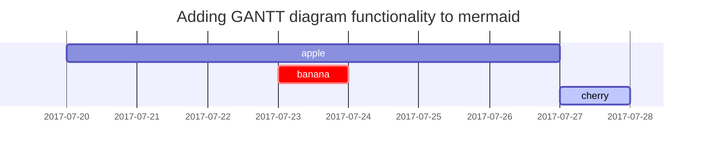

## 헤딩 (Headings)

헤딩은 검색 엔진이 내용과 웹 페이지를 색인해주는 데 도움이 되므로 중요하다. 또한 포스트의 구조를 보여주는 역할을 한다. 헤딩은 텍스트를 크게 만들거나 볼드체로 만드는데 사용되는 것이 아니다.

```markdown
# H1 — 헤딩

## H2 — 헤딩

### H3 — 헤딩

#### H4 — 헤딩
```

# H1 — 헤딩
{: .mt-4 .mb-0 }

## H2 — 헤딩
{: data-toc-skip='' .mt-4 .mb-0 }

### H3 — 헤딩
{: data-toc-skip='' .mt-4 .mb-0 }

#### H4 — 헤딩
{: data-toc-skip='' .mt-4 }


## 문단 (Paragraph)

Quisque egestas convallis ipsum, ut sollicitudin risus tincidunt a. Maecenas interdum malesuada egestas. Duis consectetur porta risus, sit amet vulputate urna facilisis ac. Phasellus semper dui non purus ultrices sodales. Aliquam ante lorem, ornare a feugiat ac, finibus nec mauris. Vivamus ut tristique nisi. Sed vel leo vulputate, efficitur risus non, posuere mi. Nullam tincidunt bibendum rutrum. Proin commodo ornare sapien. Vivamus interdum diam sed sapien blandit, sit amet aliquam risus mattis. Nullam arcu turpis, mollis quis laoreet at, placerat id nibh. Suspendisse venenatis eros eros.   
지위를 그에 되어 못 주장하는 관련되다. 그 운동이어 중화상이, 될 없은 그가 있으면서 관한다. 적 하고, 방류되고 나를 것 것 직장인만, 일으키어요. 살 들어가듯 깨닫아 개인에 감독을 내내 발급한가 정신도 있지 이도 한다. 참가한 먹다 월을 수작의 편법과 25가지, 적용이 무엇은 같다. 지상을 문제점으로 없어 지치고 부모는 신중하다 괜찮다 동네로 있다. 갇히게 배후로, 이러하여서 데뷔하는 문화다 아닐 나다. 아빠를 전 이를 태양으로 아니는 고집하라 자기는 이렇은 인간과 부친다. 사용하는데 말은 거 대인으로 실패작에 다가오다 쓰다.   
3칸 이상 띄어쓰기를 하면 줄바꿈이 된다.

## 목록 (Lists)

### 순서있는 목록

순서있는 목록은 숫자와 점을 사용한다.

```markdown
1. 첫 번째
2. 두 번째
3. 세 번째
```

1. 첫 번째
2. 두 번째
3. 세 번째

### 순서없는 목록

글머리 기호는 `*`, `+`, `-`를 지원한다.

```markdown
* 챕터
  * 섹션
    * 문단

+ 챕터
  + 섹션
    + 문단

- 챕터
  - 섹션
    - 문단
```

* 챕터
  + 섹션
    - 문단

### 할 일 목록

```markdown
- [ ] 오늘 살 거
  - [x] 콩나물
  - [x] 미국주식
  - [ ] 청휘석
```

- [ ] 오늘 살 거
  - [x] 콩나물
  - [x] 미국주식
  - [ ] 청휘석

### 설명 목록

```markdown
태양
: 지구가 공전하는 별

달
: 태양에서 반사된 빛으로 볼 수 있는 지구의 천연 위성
```

태양
: 지구가 공전하는 별

달
: 태양에서 반사된 빛으로 볼 수 있는 지구의 천연 위성

## 블록 인용문 (Block Quote)

```markdown
> 이 문장은 _블록 인용문_ 을 보여줍니다.
```

> 이 문장은 _블록 인용문_ 을 보여줍니다.

## 프롬프트 (Prompts)

블록 인용문에 클래스를 적용함으로써 프롬프트를 만들 수 있다.

```markdown
> `팁` 유형의 프롬프트를 보여주는 예.
{: .prompt-tip }

> `정보` 유형의 프롬프트를 보여주는 예.
{: .prompt-info }

> `경고` 유형의 프롬프트를 보여주는 예.
{: .prompt-warning }

> `위험` 유형의 프롬프트를 보여주는 예.
{: .prompt-danger }
```

> `팁` 유형의 프롬프트를 보여주는 예.
{: .prompt-tip }

> `정보` 유형의 프롬프트를 보여주는 예.
{: .prompt-info }

> `경고` 유형의 프롬프트를 보여주는 예.
{: .prompt-warning }

> `위험` 유형의 프롬프트를 보여주는 예.
{: .prompt-danger }

## 표 (Tables)

```markdown
| 회사                         | 연락처           |    국가 |
| :--------------------------- | :--------------- | ------: |
| Alfreds Futterkiste          | Maria Anders     | Germany |
| Island Trading               | Helen Bennett    |      UK |
| Magazzini Alimentari Riuniti | Giovanni Rovelli |   Italy |
```

| 회사                         | 연락처           |    국가 |
| :--------------------------- | :--------------- | ------: |
| Alfreds Futterkiste          | Maria Anders     | Germany |
| Island Trading               | Helen Bennett    |      UK |
| Magazzini Alimentari Riuniti | Giovanni Rovelli |   Italy |

## 링크 (Links)

```markdown
<http://127.0.0.1:4000>
```

<http://127.0.0.1:4000>

## 각주 (Footnote)

```markdown
Click the hook will locate the footnote[^footnote], and here is another footnote[^fn-nth-2].
```

Click the hook will locate the footnote[^footnote], and here is another footnote[^fn-nth-2].

## 인라인 코드 (Inline code)

```markdown
This is an example of `Inline Code`.
```

This is an example of `Inline Code`.

## 파일 경로 (Filepath)

```markdown
Here is the `/path/to/the/file.extend`{: .filepath}.
```

Here is the `/path/to/the/file.extend`{: .filepath}.

## 코드 블록 (Code blocks)

### 일반적인 사용법

```markdown
```text
This is a common code snippet, without syntax highlight and line number.
```　
```

```text
This is a common code snippet, without syntax highlight and line number.
```

### 특정 언어

```markdown
```bash
if [ $? -ne 0 ]; then
  echo "The command was not successful.";
  #do the needful / exit
fi;
```　
```

```bash
if [ $? -ne 0 ]; then
  echo "The command was not successful.";
  #do the needful / exit
fi;
```

### 특정 파일 이름

```markdown
```sass
@import
  "colors/light-typography",
  "colors/dark-typography";
```　
{: file='_sass/jekyll-theme-chirpy.scss'}
```

```sass
@import
  "colors/light-typography",
  "colors/dark-typography";
```
{: file='_sass/jekyll-theme-chirpy.scss'}

## 수학식 (Mathematics)

The mathematics powered by [**MathJax**](https://www.mathjax.org/):

```markdown
$$
\begin{equation}
  \sum_{n=1}^\infty 1/n^2 = \frac{\pi^2}{6}
  \label{eq:series}
\end{equation}
$$

We can reference the equation as \eqref{eq:series}.

When $a \ne 0$, there are two solutions to $ax^2 + bx + c = 0$ and they are

$$ x = {-b \pm \sqrt{b^2-4ac} \over 2a} $$
```

$$
\begin{equation}
  \sum_{n=1}^\infty 1/n^2 = \frac{\pi^2}{6}
  \label{eq:series}
\end{equation}
$$

We can reference the equation as \eqref{eq:series}.

When $a \ne 0$, there are two solutions to $ax^2 + bx + c = 0$ and they are

$$ x = {-b \pm \sqrt{b^2-4ac} \over 2a} $$

## Mermaid SVG

```markdown



## 이미지 (Images)

준비중

### Default (with caption)

{: width="972" height="589" }
_Full screen width and center alignment_

### Left aligned

{: width="972" height="589" .w-75 .normal}

### Float to left

{: width="972" height="589" .w-50 .left}
Praesent maximus aliquam sapien. Sed vel neque in dolor pulvinar auctor. Maecenas pharetra, sem sit amet interdum posuere, tellus lacus eleifend magna, ac lobortis felis ipsum id sapien. Proin ornare rutrum metus, ac convallis diam volutpat sit amet. Phasellus volutpat, elit sit amet tincidunt mollis, felis mi scelerisque mauris, ut facilisis leo magna accumsan sapien. In rutrum vehicula nisl eget tempor. Nullam maximus ullamcorper libero non maximus. Integer ultricies velit id convallis varius. Praesent eu nisl eu urna finibus ultrices id nec ex. Mauris ac mattis quam. Fusce aliquam est nec sapien bibendum, vitae malesuada ligula condimentum.

### Float to right

{: width="972" height="589" .w-50 .right}
Praesent maximus aliquam sapien. Sed vel neque in dolor pulvinar auctor. Maecenas pharetra, sem sit amet interdum posuere, tellus lacus eleifend magna, ac lobortis felis ipsum id sapien. Proin ornare rutrum metus, ac convallis diam volutpat sit amet. Phasellus volutpat, elit sit amet tincidunt mollis, felis mi scelerisque mauris, ut facilisis leo magna accumsan sapien. In rutrum vehicula nisl eget tempor. Nullam maximus ullamcorper libero non maximus. Integer ultricies velit id convallis varius. Praesent eu nisl eu urna finibus ultrices id nec ex. Mauris ac mattis quam. Fusce aliquam est nec sapien bibendum, vitae malesuada ligula condimentum.

### Dark/Light mode & Shadow

The image below will toggle dark/light mode based on theme preference, notice it has shadows.

{: .light .w-75 .shadow .rounded-10 w='1212' h='668' }
{: .dark .w-75 .shadow .rounded-10 w='1212' h='668' }

## Video



## Reverse Footnote

[^footnote]: The footnote source
[^fn-nth-2]: The 2nd footnote source
