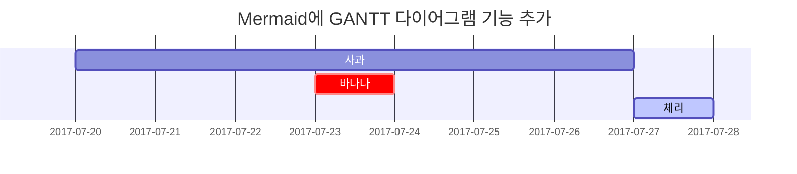

## 마크다운 (Markdown)

Chirpy 테마에서 포스트는 마크다운 파일(`*.md`{: .filepath})를 통해 만들 수 있다. 포스트의 디렉토리는 `/_posts`{: .filepath} 이며 포스트의 파일명은 `YYYY-MM-DD-제목.md` 형식으로 작성한다. 제목에 띄어쓰기가 들어있을 경우 띄어쓰기 대신 `-`를 사용한다.   
해당 포스트의 파일명은 `2024-11-22-텍스트-및-타이포그래피.md`이다.

## Front Matter

포스트를 작성하기 전에, 아래와 같은 양식을 먼저 입력해야 한다. 해당 포스트에 쓰인 Front Matter는 다음과 같다.

```yaml
---
title: Jekyll Chirpy 테마에서 포스트 작성하기
description: 텍스트, 타이포그래피, 수학 방정식, 다이어그램, 순서도, 그림, 동영상 등의 예시
date: 2024-11-22 23:06:00 +0900
categories: [Jekyll, Chirpy]
tags: [GitHub, 깃허브, Jekyll, Chirpy, 블로그]
math: true
mermaid: true
image:
  path: /assets/img/20241122/duck.jpg
  lqip: data:image/webp;base64,UklGRsoAAABXRUJQVlA4IL4AAABwBACdASoVAA4APm0qkkWkIqGYBABABsSyAE6ZQYwAIw7jbxW9+sSQ5Dt9WAD+8zDewbCg2rs3d1HxobW4XNvQQ+EYLGOL/e5VHfBx6ZuP7euf5lg6Ika/J+dh5auWZ9eMruBIcqX4kXKdJ+0YUOwrkRkVuE4O9Go1BFfTfr8Ezvye3R9LD5vqs2CYsoVlXQlsWDxPC6ozQud+ttWXz8ffLDfVrM4rwXozU8zz7eYZKAkeQR88/AO6/pw6gAAA
---
```

### date

`date`는 **포스트가 작성된 시각**으로 `YYYY-MM-DD HH-MM-SS ±TTTT` 형식으로 작성한다.   
`±TTTT`로 **timezone**을 설정할 수 있다. 한국 시간 기준은 `+0900`이다.

### categories와 tags

`categories` 필드에는 **2개의 카테고리 단어**가 들어가며 `tags` 필드에는 포스트의 태그 단어들이 들어간다.

```yaml
categories: [대분류, 소분류]
tags: [asdf, 어쩌고, 저쩌고]
```

> `tags` 필드의 요소중 영어는 반드시 **소문자**로 이루어져야 한다.
{: .prompt-warning}

### toc (Table of Contents)

`toc`는 Table of Contents의 약자로 **페이지 우측 패널**에 있는 **바로가기**이다. `true`와 `false`로 이 기능을 켜고 끌 수 있다.   
기본값 설정은 `_config.yml`에 있다.

```yaml
toc: false
```

### comments

`true`와 `false`로 포스트의 **댓글 기능**을 켜고 끌 수 있다. 이 또한 `_config.yml`에서 기본값 설정이 가능하다.

```yaml
comments: false
```

### pin

`true`로 설정하면 포스트가 웹페이지 메인에 **고정**된다. 기본적으로 꺼져있다.

```yaml
pin: true
```

### math

후술할 **수학식 기능**을 켜고 끌 수 있다. 성능적인 이유 때문에 기본적으로 꺼져있다.

```yaml
math: true
```

### mermaid

Mermaid는 **다이어그램**을 생성하는 도구이다.

```yaml
mermaid: true
```

### image

포스트의 **썸네일**이자 **최상단에 노출**되는 이미지이다. 이미지 경로만 입력해도 되지만 성능 향상을 위해 lqip(low quality image placeholder)를 추가로 적용할 수 있다. `lqip`에는 base64로 인코딩된 이미지 정보를 넣는다.

```yaml
image: /path/to/image.png
```

```yaml
image:
  path: /path/to/image.png
  lqip: data:image/webp;base64,UklGRsoAAABXRUJQVlA4IL4AAABwBACdASoVAA4APm0qkkWkIqGYBABABsSyAE6ZQYwAIw7jbxW9+sSQ5Dt9WAD+8zDewbCg2rs3d1HxobW4XNvQQ+EYLGOL/e5VHfBx6ZuP7euf5lg6Ika/J+dh5auWZ9eMruBIcqX4kXKdJ+0YUOwrkRkVuE4O9Go1BFfTfr8Ezvye3R9LD5vqs2CYsoVlXQlsWDxPC6ozQud+ttWXz8ffLDfVrM4rwXozU8zz7eYZKAkeQR88/AO6/pw6gAAA
```

## 헤딩 (Headings)

헤딩은 검색 엔진이 내용과 웹 페이지를 색인해주는 데 도움이 되므로 중요하다. 또한 포스트의 구조를 보여주는 역할을 한다. **헤딩은 텍스트를 크게 만들거나 볼드체로 만드는데 사용되는 것이 아니다.**

```markdown
# H1 — 헤딩

## H2 — 헤딩

### H3 — 헤딩

#### H4 — 헤딩
```

# H1 — 헤딩
{: .mt-4 .mb-0 }

## H2 — 헤딩
{: data-toc-skip='' .mt-4 .mb-0 }

### H3 — 헤딩
{: data-toc-skip='' .mt-4 .mb-0 }

#### H4 — 헤딩
{: data-toc-skip='' .mt-4 }

## 문단 (Paragraph)

```markdown
문단은 HTML상에서 <p> 태그로 구성되며, 두 번의 줄바꿈으로 구분된다.

만약 줄바꿈을 한 번밖에 입력하지 않는다면.
이런식으로 표시된다.
```
문단은 HTML상에서 <p> 태그로 구성되며, 두 번의 줄바꿈으로 구분된다.

만약 줄바꿈을 한 번밖에 입력하지 않는다면.
이런식으로 표시된다.

> 문장의 끝에 *3칸 이상 띄어쓰기* 를 하면 문단 내에서 **줄 바꿈**이 된다.
{: .prompt-tip }

## 강조 (Emphasis)

```markdown
이텔릭체는 *별 기호(Asterisks)* 혹은 _언더바 기호(Underscore)_ 를 사용한다.   
두껍게는 **별 기호(Asterisks)** 혹은 __언더바 기호(Underscore)__ 를 2번씩 사용한다.   
__*이텔릭체* 와 두껍게__ 를 혼용할 수도 있다.

취소선은 ~~물결 기호(tilde)~~ 를 사용한다.   
<u>밑줄</u>은 마크다운에서 지원하지 않기에, 직접 `<u></u>` 태그를 사용해야 한다.
```

이텔릭체는 *별 기호(Asterisks)* 혹은 _언더바 기호(Underscore)_ 를 사용한다.   
두껍게는 **별 기호(Asterisks)** 혹은 __언더바 기호(Underscore)__ 를 2번씩 사용한다.   
__*이텔릭체* 와 두껍게__ 를 혼용할 수도 있다.

취소선은 ~~물결 기호(tilde)~~ 를 사용한다.   
<u>밑줄</u>은 마크다운에서 지원하지 않기에, 직접 `<u></u>` 태그를 사용해야 한다.

> *이탈릭체* 를 문장 중간에 사용할 경우에는 강조 표현 다음에 **띄어쓰기**를 사용하는 것이 좋다.
{: .prompt-warning }

## 목록 (Lists)

### 순서 있는 목록

순서 있는 목록은 **숫자와 점**을 사용한다.

```markdown
1. 첫 번째
2. 두 번째
3. 세 번째
```

1. 첫 번째
2. 두 번째
3. 세 번째

> 번호 순서가 바뀌어도 내림차순으로 정리된다.
> ```markdown
> 1. 첫 번째
> 3. 세 번째
> 2. 두 번째
> ```
>
> 1. 첫 번째
> 3. 세 번째
> 2. 두 번째
{: .prompt-info }

### 순서 없는 목록

글머리 기호는 `*`, `+`, `-`를 지원한다.

```markdown
* 챕터
  * 섹션
    * 문단

+ 챕터
  + 섹션
    + 문단

- 챕터
  - 섹션
    - 문단
```

* 챕터
  + 섹션
    - 문단

> 목록은 **들여쓰기(띄어쓰기 2칸)**를 지원한다.
{: .prompt-tip }

### 할 일 목록

목록에 `[ ]`와 `[x]`를 이용해 **체크 표시**를 만들 수 있다.

```markdown
- [ ] 오늘 살 거
  - [x] 콩나물
  - [x] 미국주식
  - [ ] 돌
```

- [ ] 오늘 살 거
  - [x] 콩나물
  - [x] 미국주식
  - [ ] 돌

### 설명 목록

설명하고자 하는 단어 아랫줄에 `:`으로 시작하는 문장을 적는다.

```markdown
태양
: 지구가 공전하는 별

달
: 태양에서 반사된 빛으로 볼 수 있는 지구의 천연 위성
```

태양
: 지구가 공전하는 별

달
: 태양에서 반사된 빛으로 볼 수 있는 지구의 천연 위성

## 인용문 (Block Quote)

`> `를 이용해 인용문을 만든다.

```markdown
> 이 문장은 _인용문_ 을 보여줍니다.
```

> 이 문장은 _인용문_ 을 보여줍니다.

* * *

인용문을 **중첩**해서 만들 수 있다.

```markdown
> 인용문 1
> > 중첩된 인용문(Nested BlockQuote)을 만들 수 있다.
> > > 중중첩 인용문 1   
> > > 중중첩 인용문 2   
> > > 중중첩 인용문 3
```

> 인용문 1
> > 중첩된 인용문(Nested BlockQuote)을 만들 수 있다.
> > > 중중첩 인용문 1   
> > > 중중첩 인용문 2   
> > > 중중첩 인용문 3

## 프롬프트 (Prompts)

인용문에 **클래스**를 적용함으로써 프롬프트를 만들 수 있다.

```markdown
> `팁` 유형의 프롬프트를 보여주는 예.
{: .prompt-tip }

> `정보` 유형의 프롬프트를 보여주는 예.
{: .prompt-info }

> `경고` 유형의 프롬프트를 보여주는 예.
{: .prompt-warning }

> `위험` 유형의 프롬프트를 보여주는 예.
{: .prompt-danger }
```

> `팁` 유형의 프롬프트를 보여주는 예.
{: .prompt-tip }

> `정보` 유형의 프롬프트를 보여주는 예.
{: .prompt-info }

> `경고` 유형의 프롬프트를 보여주는 예.
{: .prompt-warning }

> `위험` 유형의 프롬프트를 보여주는 예.
{: .prompt-danger }

## 수평선 (Horizontal Rule)

`---`, `___`, `***` 각 기호를 **3개 이상** 입력해, 수평선을 표현한다.

```markdown
- - -

* * *

_ _ _
```

---

***

___

## 테이블 (Tables)

테이블 헤더를 구분하기 위해, **3개 이상**의 `-` 기호를 사용한다.   
`-` 기호 앞뒤에 `:` 기호를 추가해 셀(열/칸) 안의 내용을 **정렬**할 수 있다.

- `---`, `:---` : 좌측 정렬
- `:---:` : 가운데 정렬
- `---:` : 우측 정렬

```markdown
| 값         |                  의미                  |   기본값 |
| :--------- | :------------------------------------: | -------: |
| `static`   |     유형(기준) 없음 / 배치 불가능      | `static` |
| `relative` |       요소 자신을 기준으로 배치        |          |
| `absolute` | 위치 상 부모(조상)요소를 기준으로 배치 |          |
| `fixed`    |      브라우저 창을 기준으로 배치       |          |
| `sticky`   |       스크롤 영역 기준으로 배치        |          |
```

| 값         |                  의미                  |   기본값 |
| :--------- | :------------------------------------: | -------: |
| `static`   |     유형(기준) 없음 / 배치 불가능      | `static` |
| `relative` |       요소 자신을 기준으로 배치        |          |
| `absolute` | 위치 상 부모(조상)요소를 기준으로 배치 |          |
| `fixed`    |      브라우저 창을 기준으로 배치       |          |
| `sticky`   |       스크롤 영역 기준으로 배치        |          |

### 버티컬바 기호 사용

마크다운에서 버티컬바(`|`) 기호는 테이블을 표현할 때 사용하는 문법 기능을 가진다.   
만약 테이블 안에서 버티컬바 기호 자체를 출력하려면, `\` 기호와 함께 작성하는 **이스케이프(Escape) 처리**가 필요하다.

```markdown
| 값               | 의미 |
| ---------------- | ---- |
| 버티컬바 출력    | \|   |
| 인라인 코드 강조 | `    | ` |
```

| 값               | 의미 |
| ---------------- | ---- |
| 버티컬바 출력    | \|   |
| 인라인 코드 강조 | `    | ` |

## 링크 (Links)

```markdown
[GOOGLE](https://google.com)

[NAVER](https://naver.com "링크 설명(title)을 작성하세요.")

[상대적 참조](../../about/)

[Dribbble][Dribbble Link]

[GitHub][1]

문서 안에서 [참조 링크]를 그대로 사용할 수도 있다.   
다음과 같이 꺾쇠 괄호(`< >`, Angle Brackets)안의 URL은 자동으로 링크를 사용한다.

구글 홈페이지: <https://google.com>

[Dribbble Link]: https://dribbble.com
[1]: https://github.com
[참조 링크]: https://naver.com "네이버로 이동합니다"
```

[GOOGLE](https://google.com)

[NAVER](https://naver.com "링크 설명(title)을 작성하세요.")

[상대적 참조](../../about/)

[Dribbble][Dribbble Link]

[GitHub][1]

문서 안에서 [참조 링크]를 그대로 사용할 수도 있다.   
다음과 같이 꺾쇠 괄호(`< >`, Angle Brackets)안의 URL은 자동으로 링크를 사용한다.

구글 홈페이지: <https://google.com>

[Dribbble Link]: https://dribbble.com
[1]: https://github.com
[참조 링크]: https://naver.com "네이버로 이동합니다"

## 각주 (Footnote)

`[ ]` 안에 `^`와 각주 이름을 입력해서 **각주로 이동하는 링크**를 만든다. 각주의 내용은 [역각주](./#역각주-reverse-footnote) 문단 참조.

```markdown
각주[^footnote]를 클릭해 해당 각주로 이동한다. 또 다른 각주[^fn-nth-2]의 예.
```

각주[^footnote]를 클릭해 해당 각주로 이동한다. 또 다른 각주[^fn-nth-2]의 예.

## 인라인 코드 (Inline code)

강조할 코드를 `` ` `` 기호로 감싸 인라인 코드를 표현한다.

```markdown
`background` 혹은 `background-image` 속성으로 요소에 배경 이미지를 삽입할 수 있다.
```

`background` 혹은 `background-image` 속성으로 요소에 배경 이미지를 삽입할 수 있다.

## 파일 경로 (Filepath)

인라인 코드에 클래스를 적용하여 이 문자열이 **파일 경로**임을 보여줄 수 있다.

```markdown
파일 경로는 `/path/to/the/file.extend`{: .filepath} 이다.
```

파일 경로는 `/path/to/the/file.extend`{: .filepath} 이다.

## 코드 블록 (Code blocks)

`` ` ``를 **3번 이상** 입력하고 **언어(코드) 이름**을 명시해 코드 블록을 표현한다.   

### 일반적인 사용

````markdown
```
This is a common code snippet, without syntax highlight and line number.
```
````

```
This is a common code snippet, without syntax highlight and line number.
```

> 코드 블록의 시작 `` ` `` 개수와 종료 `` ` `` 개수는 같아야 한다.
{: .prompt-warning}

### 특정 언어

시작 `` ` `` 뒤에 **언어의 이름**을 입력해서 어떤 언어로 작성된 코드인지 명시할 수 있다.

````markdown
```c++
#include <iostream>

int main() {
    std::cout << "Hello World!";
    return 0;
}
```
````

```c++
#include <iostream>

int main() {
    std::cout << "Hello World!";
    return 0;
}
```

### 특정 파일 이름

코드 블록에 `file` 속성을 추가해 언어 이름 대신 **특정 파일 이름**을 명시할 수 있다.

```markdown
```sass
@import
  "colors/light-typography",
  "colors/dark-typography";
```　
{: file='_sass/jekyll-theme-chirpy.scss'}
```

```sass
@import
  "colors/light-typography",
  "colors/dark-typography";
```
{: file='_sass/jekyll-theme-chirpy.scss'}

## 수학식 (Mathematics)

The mathematics powered by [**MathJax**](https://www.mathjax.org/):

```
$$
\begin{equation}
  \sum_{n=1}^\infty 1/n^2 = \frac{\pi^2}{6}
  \label{eq:series}
\end{equation}
$$

방정식은 다음과 같이 참조할 수 있다: \eqref{eq:series}.

$a \ne 0$ 일 때, 이차함수 $ax^2 + bx + c = 0$ 에는 두 개의 해가 존재한다.

$$ x = {-b \pm \sqrt{b^2-4ac} \over 2a} $$
```

$$
\begin{equation}
  \sum_{n=1}^\infty 1/n^2 = \frac{\pi^2}{6}
  \label{eq:series}
\end{equation}
$$

방정식은 다음과 같이 참조할 수 있다: \eqref{eq:series}.

$a \ne 0$ 일 때, 이차함수 $ax^2 + bx + c = 0$ 에는 두 개의 해가 존재한다.

$$ x = {-b \pm \sqrt{b^2-4ac} \over 2a} $$

## Mermaid SVG

````

````


## 이미지 (Images)

링크과 비슷하지만, 앞에 `!`를 추가해야 한다.

```markdown
")

```

")


### 왼쪽 정렬

```markdown
{: width="972" height="589" .w-75 .normal}
```

{: width="972" height="589" .w-75 .normal}

### 왼쪽에 Float

```markdown
{: width="972" height="589" .w-50 .left}
Praesent maximus aliquam sapien. Sed vel neque in dolor pulvinar auctor. Maecenas pharetra, sem sit amet interdum posuere, tellus lacus eleifend magna, ac lobortis felis ipsum id sapien. Proin ornare rutrum metus, ac convallis diam volutpat sit amet. Phasellus volutpat, elit sit amet tincidunt mollis, felis mi scelerisque mauris, ut facilisis leo magna accumsan sapien. In rutrum vehicula nisl eget tempor. Nullam maximus ullamcorper libero non maximus. Integer ultricies velit id convallis varius. Praesent eu nisl eu urna finibus ultrices id nec ex. Mauris ac mattis quam. Fusce aliquam est nec sapien bibendum, vitae malesuada ligula condimentum.
```

{: width="972" height="589" .w-50 .left}
Praesent maximus aliquam sapien. Sed vel neque in dolor pulvinar auctor. Maecenas pharetra, sem sit amet interdum posuere, tellus lacus eleifend magna, ac lobortis felis ipsum id sapien. Proin ornare rutrum metus, ac convallis diam volutpat sit amet. Phasellus volutpat, elit sit amet tincidunt mollis, felis mi scelerisque mauris, ut facilisis leo magna accumsan sapien. In rutrum vehicula nisl eget tempor. Nullam maximus ullamcorper libero non maximus. Integer ultricies velit id convallis varius. Praesent eu nisl eu urna finibus ultrices id nec ex. Mauris ac mattis quam. Fusce aliquam est nec sapien bibendum, vitae malesuada ligula condimentum.

### 오른쪽에 Float

```markdown
{: width="972" height="589" .w-50 .right}
Praesent maximus aliquam sapien. Sed vel neque in dolor pulvinar auctor. Maecenas pharetra, sem sit amet interdum posuere, tellus lacus eleifend magna, ac lobortis felis ipsum id sapien. Proin ornare rutrum metus, ac convallis diam volutpat sit amet. Phasellus volutpat, elit sit amet tincidunt mollis, felis mi scelerisque mauris, ut facilisis leo magna accumsan sapien. In rutrum vehicula nisl eget tempor. Nullam maximus ullamcorper libero non maximus. Integer ultricies velit id convallis varius. Praesent eu nisl eu urna finibus ultrices id nec ex. Mauris ac mattis quam. Fusce aliquam est nec sapien bibendum, vitae malesuada ligula condimentum.
```

{: width="972" height="589" .w-50 .right}
Praesent maximus aliquam sapien. Sed vel neque in dolor pulvinar auctor. Maecenas pharetra, sem sit amet interdum posuere, tellus lacus eleifend magna, ac lobortis felis ipsum id sapien. Proin ornare rutrum metus, ac convallis diam volutpat sit amet. Phasellus volutpat, elit sit amet tincidunt mollis, felis mi scelerisque mauris, ut facilisis leo magna accumsan sapien. In rutrum vehicula nisl eget tempor. Nullam maximus ullamcorper libero non maximus. Integer ultricies velit id convallis varius. Praesent eu nisl eu urna finibus ultrices id nec ex. Mauris ac mattis quam. Fusce aliquam est nec sapien bibendum, vitae malesuada ligula condimentum.

### 다크모드/라이트모드 & 그림자

아래 이미지는 **테마 환경설정**에 따라 **어두운/밝기 모드**로 전환된다. *그림자* 도 적용 가능하다.

```markdown
{: .light .w-75 .shadow .rounded-10 w='1212' h='668' }
{: .dark .w-75 .shadow .rounded-10 w='1212' h='668' }
```

{: .light .w-75 .shadow .rounded-10 w='1212' h='668' }
{: .dark .w-75 .shadow .rounded-10 w='1212' h='668' }

## 영상 (Video)

```markdown
{\% include embed/youtube.html id='0Da8ZhKcNKQ' %}
```
> 코드 블록에 있는 `\`(이스케이프 문자열)은 뺄 것



## 역각주 (Reverse Footnote)

```markdown
[^footnote]: 각주 내용
[^fn-nth-2]: 두 번째 각주 내용
```

[^footnote]: 각주 내용
[^fn-nth-2]: 두 번째 각주 내용
